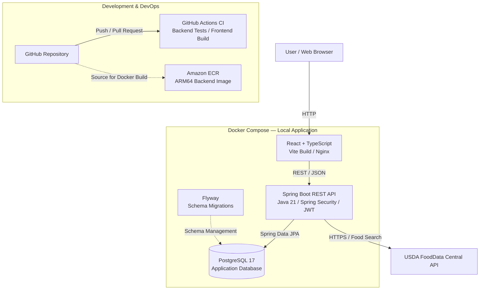

# FitBud

FitBud is a full-stack nutrition tracking application designed to help users manage their nutrition goals, search for foods, log meals, and monitor daily calorie and macronutrient intake.

The project was built as a production-oriented full-stack application using React, TypeScript, Spring Boot, PostgreSQL, Docker, and AWS tooling. It includes secure JWT authentication, database migrations, automated backend testing, external food data integration, and a containerized three-tier architecture.

## Features

- User registration and login
- JWT-based authentication and authorization
- Secure password hashing with BCrypt
- User profile creation and management
- Personalized calorie and macronutrient goals
- Food catalog management
- USDA FoodData Central food search
- Meal and food logging
- Daily calorie and macronutrient summaries
- User-level resource ownership and authorization
- Responsive React frontend
- PostgreSQL persistence
- Flyway database migrations
- Automated backend testing
- Dockerized frontend, backend, and database
- Amazon ECR container image publishing

## Tech Stack

### Frontend

- React
- TypeScript
- Vite
- React Router
- CSS
- Nginx

### Backend

- Java 21
- Spring Boot
- Spring Security
- Spring Data JPA
- JWT Authentication
- BCrypt
- Maven
- Flyway

### Database

- PostgreSQL 17

### Infrastructure & DevOps

- Docker
- Docker Compose
- Multi-stage Docker builds
- Nginx
- Amazon Web Services (AWS)
- Amazon Elastic Container Registry (ECR)
- Git
- GitHub

### External API

- USDA FoodData Central API

## Architecture

FitBud uses a three-tier architecture with a React frontend, a Spring Boot REST API, and a PostgreSQL database. Docker Compose orchestrates the application locally, while GitHub Actions automates testing and build verification.



### Infrastructure and Deployment

- **Frontend:** React and TypeScript are compiled with Vite and served by Nginx.
- **Backend:** Spring Boot provides REST endpoints secured with JWT authentication.
- **Database:** PostgreSQL persists application data, with Flyway managing schema migrations.
- **External integration:** The backend communicates with USDA FoodData Central to retrieve food information.
- **Local infrastructure:** Docker Compose runs the frontend, backend, and database as separate containers.
- **Continuous integration:** GitHub Actions automatically executes backend tests, frontend linting, and production builds.
- **Container registry:** The ARM64 backend Docker image has been published to Amazon ECR.

**Deployment status:** FitBud runs locally through Docker Compose. Its backend image is published to Amazon ECR, but the application is not publicly deployed to AWS.

## Security

FitBud uses stateless JWT authentication.

After authentication, protected API requests include a bearer token:

```text
Authorization: Bearer <JWT>
```

The backend uses Spring Security to protect application endpoints and enforce authenticated access.

User-owned resources such as profiles, nutrition goals, and food logs are validated against the authenticated account to prevent users from accessing another user's data.

Passwords are stored using BCrypt hashing rather than plaintext.

Secrets such as database passwords, JWT signing keys, and external API keys are supplied through environment variables and are excluded from version control.

## Database Management

FitBud uses PostgreSQL for persistent application data.

Database schema changes are managed using Flyway versioned migrations rather than Hibernate automatically modifying the production schema.

Hibernate validates the schema when the application starts:

```properties
spring.jpa.hibernate.ddl-auto=validate
```

This provides predictable and reproducible database evolution.

## Docker

FitBud uses a containerized architecture consisting of:

```text
fitbud-frontend
fitbud-backend
fitbud-postgres
```

The backend and frontend use multi-stage Docker builds to separate build dependencies from their final runtime images.

The Spring Boot production container also runs as a dedicated non-root user.

### Start the Application

Create a `.env` file in the project root containing the required environment variables.

Then run:

```bash
docker compose --env-file .env -f infrastructure/compose.yaml up -d --build
```

Once the containers are running:

```text
Frontend: http://localhost:3000
Backend:  http://localhost:8080
```

The backend health endpoint is available at:

```text
http://localhost:8080/api/health
```

Expected response:

```json
{
  "status": "UP",
  "application": "FitBud"
}
```

### Stop the Application

```bash
docker compose --env-file .env -f infrastructure/compose.yaml down
```

## Environment Variables

FitBud uses environment variables for configuration.

Required backend configuration includes:

```text
DB_PASSWORD
FITBUD_JWT_SECRET
USDA_API_KEY
```

Frontend API configuration:

```text
VITE_API_BASE_URL
```

Do not commit `.env` files or production credentials to version control.

## API Overview

### Authentication

```text
POST /api/auth/register
POST /api/auth/login
```

### Profiles

```text
POST /api/profiles
GET  /api/profiles/me
GET  /api/profiles/{id}
```

### Nutrition Goals

```text
POST /api/profiles/{profileId}/nutrition-goals
GET  /api/profiles/{profileId}/nutrition-goals
```

### Food Catalog

```text
POST /api/foods
GET  /api/foods
GET  /api/foods/{id}
```

### Food Logging

```text
POST   /api/profiles/{profileId}/food-logs
GET    /api/profiles/{profileId}/food-logs
DELETE /api/profiles/{profileId}/food-logs/{logId}
```

### Nutrition Summary

```text
GET /api/profiles/{profileId}/nutrition-summary
```

### External Food Search

```text
GET /api/external-foods/search?query={query}
```

### Health

```text
GET /api/health
```

## Automated Testing

The backend includes an automated test suite covering application functionality and API behavior.

Run the tests with:

```bash
cd backend
./mvnw test
```

## Frontend Development

Install dependencies:

```bash
cd frontend
npm install
```

Start the development server:

```bash
npm run dev
```

Run ESLint:

```bash
npm run lint
```

Create a production build:

```bash
npm run build
```

## AWS / Container Registry

The FitBud Spring Boot backend has been packaged as a production ARM64 Docker image and published to a private Amazon Elastic Container Registry (ECR) repository.

This validates the container build and registry portion of a cloud deployment workflow while keeping production credentials and infrastructure configuration outside the source repository.

## Project Structure

```text
FitBud/
├── backend/
│   ├── src/
│   │   ├── main/
│   │   │   ├── java/
│   │   │   └── resources/
│   │   │       └── db/
│   │   │           └── migration/
│   │   └── test/
│   ├── Dockerfile
│   ├── pom.xml
│   └── mvnw
│
├── frontend/
│   ├── src/
│   │   ├── api/
│   │   ├── components/
│   │   ├── context/
│   │   ├── pages/
│   │   └── types/
│   ├── Dockerfile
│   ├── nginx.conf
│   └── package.json
│
├── infrastructure/
│   └── compose.yaml
│
└── README.md
```

## Key Engineering Concepts Demonstrated

FitBud demonstrates practical experience with:

- Full-stack application architecture
- REST API design
- Object-oriented Java development
- React and TypeScript development
- Authentication and authorization
- JWT security
- Relational database design
- ORM and JPA
- Database schema migrations
- Third-party REST API integration
- Automated testing
- Environment-based configuration
- Docker containerization
- Multi-container orchestration
- Production-oriented Docker builds
- AWS container registry workflows
- Git-based source control

## Project Status

FitBud is actively developed as a software engineering portfolio project.

The application currently supports the complete core nutrition tracking workflow from account registration and profile configuration through food discovery, meal logging, and daily nutrition tracking.